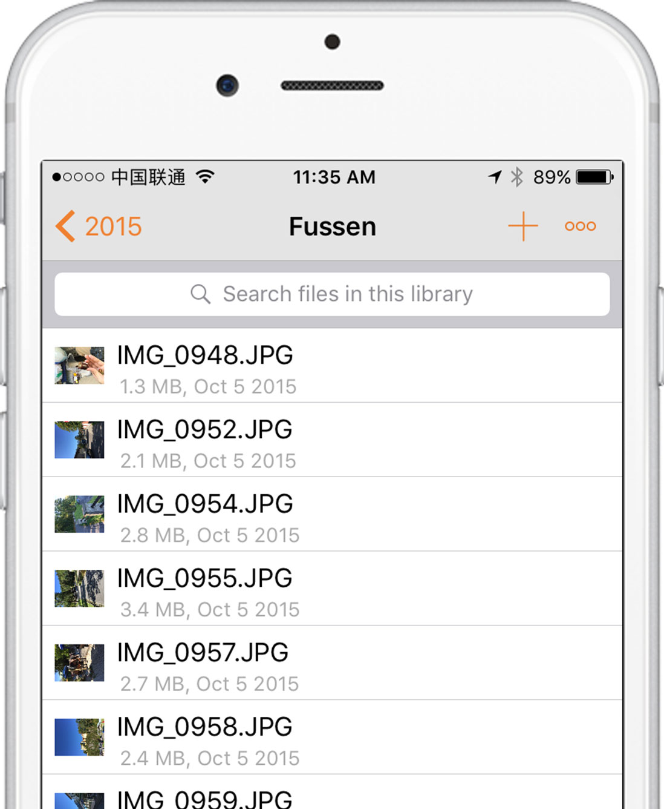
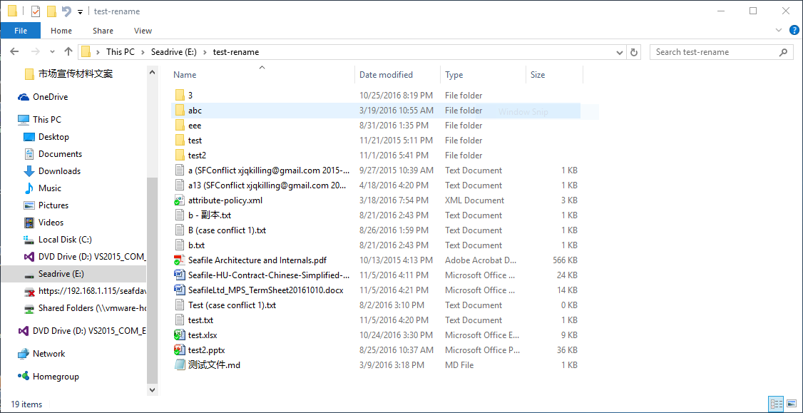
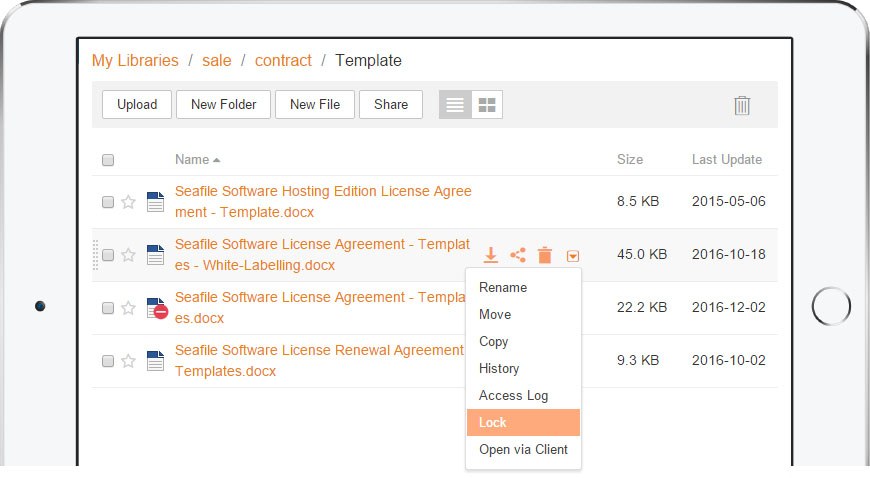
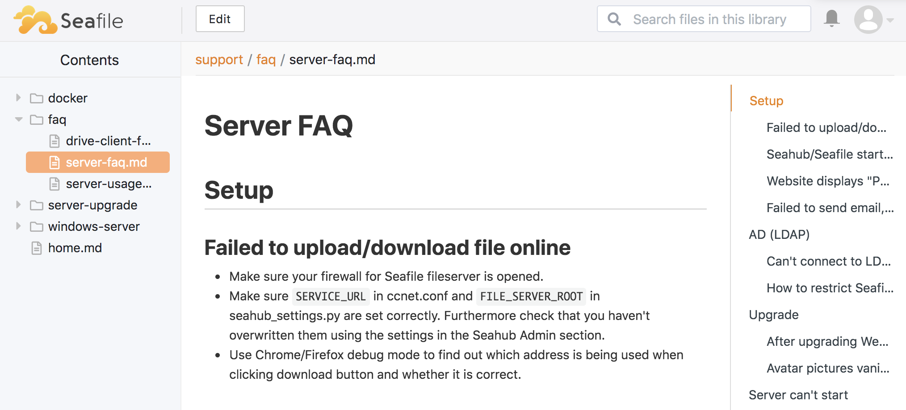
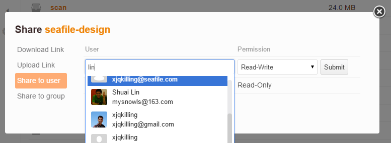
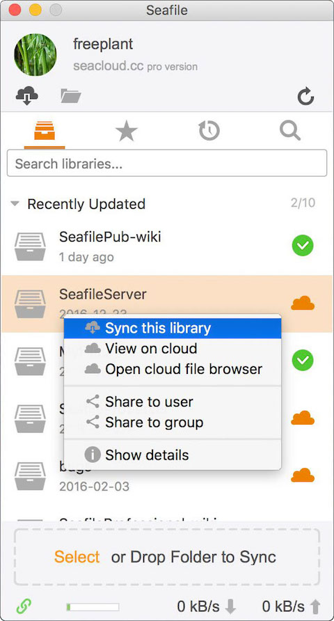

# Seafile pour YunoHost

[](https://dash.yunohost.org/appci/app/seafile)    
[](https://install-app.yunohost.org/?app=seafile)

*[Read this readme in english.](./README.md)*
*[Lire ce readme en français.](./README_fr.md)*

> *Ce package vous permet d'installer Seafile rapidement et simplement sur un serveur YunoHost.
Si vous n'avez pas YunoHost, regardez [ici](https://yunohost.org/#/install) pour savoir comment l'installer et en profiter.*

## Vue d'ensemble

Seafile is an open Source Cloud Storage application.

It's a Enterprise file sync and share platform with high reliability and performance. It's a file hosting platform with high reliability and performance. Put files on your own server. Sync and share files across different devices, or access all the files as a virtual disk.


**Version incluse :** 9.0.2~ynh1

**Démo :** https://demo.seafile.com

## Captures d'écran










## Avertissements / informations importantes

### Multi-users support

This app support LDAP and the SSO authentification.

If you have Seafile installed before 7.x and you have more than one domain for users in Yunohost or Seafile app is installed on a different domain, you need to migrate your accounts.
You can use the provided action at https://domain.tld/yunohost/admin/#/apps/seafile/actions. You can also use this following command to migrate all of your accounts:
```
yunohost app action run seafile migrate_user_email_to_mail_email
```
See [issue#44](https://github.com/YunoHost-Apps/seafile_ynh/issues/44)
for more information.

### Supported architectures

Since seafile 6.3 the i386 architecture is no more supported.

Seafile don't distribute binary for generic armhf architectures but rpi binary generally work on all arm board.

<!--Limitations
------------

* Any known limitations.-->

Additional informations
-----------------------

### Links

 * Report a bug: https://github.com/YunoHost-Apps/seafile_ynh/issues
 * App website: https://www.seafile.com
 * YunoHost website: https://yunohost.org/

---

### Install

From command line:

`yunohost app install seafile`

### Upgrade

By default a backup is made before the upgrade. To avoid this you have theses following possibilites:
- Pass the `NO_BACKUP_UPGRADE` env variable with `1` at each upgrade. By example `NO_BACKUP_UPGRADE=1 yunohost app upgrade synapse`.
- Set the settings `disable_backup_before_upgrade` to `1`. You can set this with this command:

`yunohost app setting synapse disable_backup_before_upgrade -v 1`

After this settings will be applied for **all** next upgrade.

From command line:

`yunohost app upgrade seafile`

### Backup

This app use now the core-only feature of the backup. To keep the integrity of the data and to have a better guarantee of the restoration is recommended to proceed like this:

- Stop seafile service with theses following command:

`systemctl stop seafile.service seahub.service`

- Launch the backup of seafile with this following command:

`yunohost backup create --app seafile`

- Do a backup of your data with your specific strategy (could be with rsync, borg backup or just cp). The data is stored in `/home/yunohost.app/seafile-data`.
- Restart the seafile service with theses command:

`systemctl start seafile.service seahub.service`

### Remove

Due of the backup core only feature the data directory in `/home/yunohost.app/seafile-data` **is not removed**. It need to be removed manually to purge app user data.

### Change URL

Since now it's possible to change domain or the url of seafile.

To do this run : `yunohost app change-url seafile -d new_domain.tld -p PATH new_path`

Developers infos
----------------

Please do your pull request to the [testing branch](https://github.com/YunoHost-Apps/seafile_ynh/tree/testing).

To try the testing branch, please proceed like that.
```
sudo yunohost app install https://github.com/YunoHost-Apps/seafile_ynh/tree/testing --debug
or
sudo yunohost app upgrade seafile -u https://github.com/YunoHost-Apps/seafile_ynh/tree/testing --debug
```

TODO
----

- Find a way to fix the issue https://github.com/YunoHost-Apps/seafile_ynh/issues/5

## Documentations et ressources

* Site officiel de l'app : https://www.seafile.com
* Documentation officielle de l'admin : https://manual.seafile.com
* Dépôt de code officiel de l'app : https://github.com/haiwen/seafile-server
* Documentation YunoHost pour cette app : https://yunohost.org/app_seafile
* Signaler un bug : https://github.com/YunoHost-Apps/seafile_ynh/issues

## Informations pour les développeurs

Merci de faire vos pull request sur la [branche testing](https://github.com/YunoHost-Apps/seafile_ynh/tree/testing).

Pour essayer la branche testing, procédez comme suit.
```
sudo yunohost app install https://github.com/YunoHost-Apps/seafile_ynh/tree/testing --debug
ou
sudo yunohost app upgrade seafile -u https://github.com/YunoHost-Apps/seafile_ynh/tree/testing --debug
```

**Plus d'infos sur le packaging d'applications :** https://yunohost.org/packaging_apps
