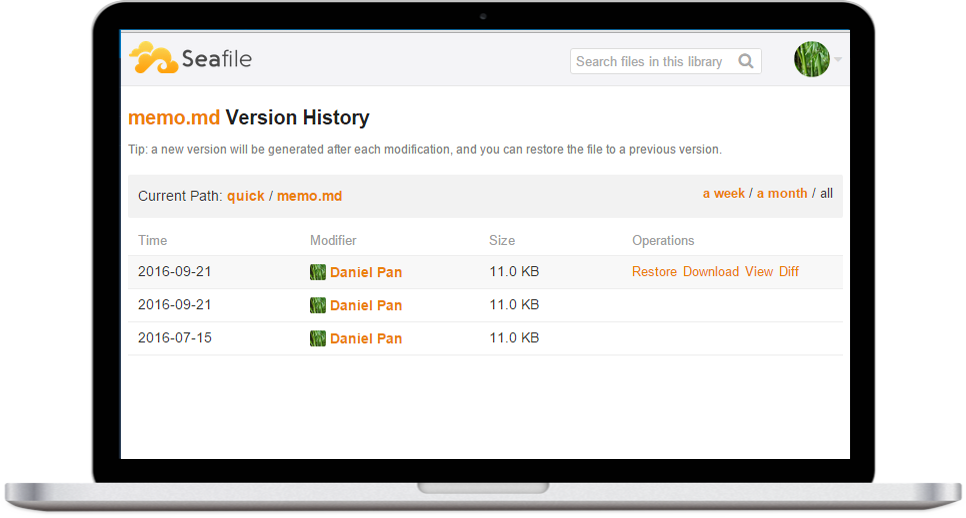

<!--
NOTA: Este README foi creado automáticamente por <https://github.com/YunoHost/apps/tree/master/tools/readme_generator>
NON debe editarse manualmente.
-->

# Seafile para YunoHost

[](https://dash.yunohost.org/appci/app/seafile)  

[](https://install-app.yunohost.org/?app=seafile)

*[Le este README en outros idiomas.](./ALL_README.md)*

> *Este paquete permíteche instalar Seafile de xeito rápido e doado nun servidor YunoHost.*  
> *Se non usas YunoHost, le a [documentación](https://yunohost.org/install) para saber como instalalo.*

## Vista xeral

Seafile is an open Source Cloud Storage application.

It's a Enterprise file sync and share platform with high reliability and performance. It's a file hosting platform with high reliability and performance. Put files on your own server. Sync and share files across different devices, or access all the files as a virtual disk.


**Versión proporcionada:** 11.0.9~ynh1

**Demo:** <https://demo.seafile.com>

## Capturas de pantalla



## Documentación e recursos

- Web oficial da app: <https://www.seafile.com>
- Documentación oficial para admin: <https://manual.seafile.com>
- Repositorio de orixe do código: <https://github.com/haiwen/seafile-server>
- Tenda YunoHost: <https://apps.yunohost.org/app/seafile>
- Informar dun problema: <https://github.com/YunoHost-Apps/seafile_ynh/issues>

## Info de desenvolvemento

Envía a túa colaboración á [rama `testing`](https://github.com/YunoHost-Apps/seafile_ynh/tree/testing).

Para probar a rama `testing`, procede deste xeito:

```bash
sudo yunohost app install https://github.com/YunoHost-Apps/seafile_ynh/tree/testing --debug
ou
sudo yunohost app upgrade seafile -u https://github.com/YunoHost-Apps/seafile_ynh/tree/testing --debug
```

**Máis info sobre o empaquetado da app:** <https://yunohost.org/packaging_apps>
